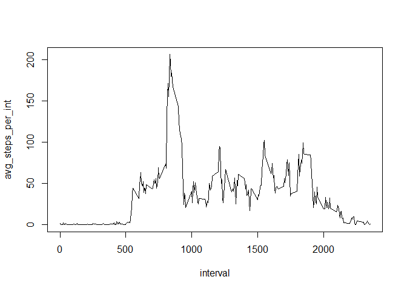
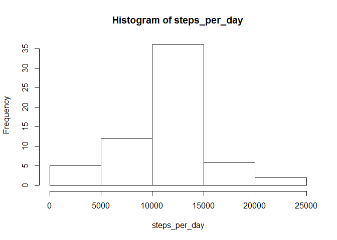
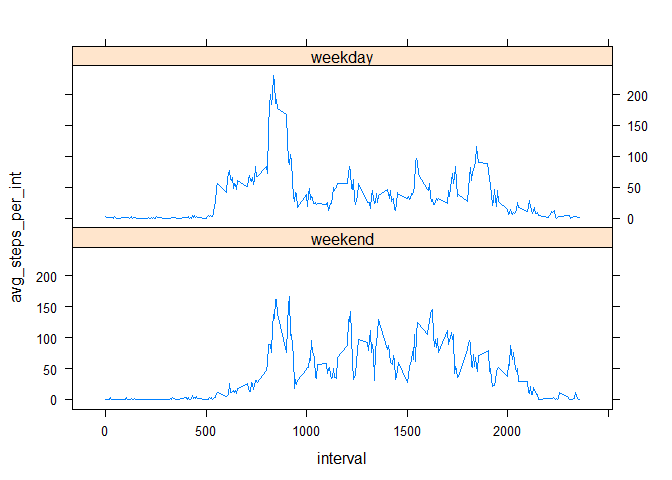

# Reproducible Research: Peer Assessment 1


## Loading and preprocessing the data
Data is loaded from the activity.csv file, as downloaded from [my GitHub repo](https://github.com/EricBeckert/RepData_PeerAssessment1) on January 20, 2017, 12:27.  
The data is then grouped and summarised, once by date, once by time-interval.  

```r
df_activity <- read.csv("activity.csv", colClasses = c("steps" = "numeric", "date" = "Date", "interval" = "integer"))
df_act_date <- df_activity %>% group_by(date) %>% summarise(steps_per_day = sum(steps))
df_act_int <- df_activity %>% group_by(interval) %>% summarise(avg_steps_per_int = mean(steps, na.rm = TRUE))
```


## What is mean total number of steps taken per day?
This is a histogram of the total number of steps taken each day:  

```r
with(df_act_date, hist(steps_per_day))
```

<!-- -->

```r
mean_steps <- mean(df_act_date$steps_per_day, na.rm = TRUE)
median_steps <- median(df_act_date$steps_per_day, na.rm = TRUE)
```
The mean number of steps each day is 10766.1886792.  
The median number of steps each day is 10765.  


## What is the average daily activity pattern?
This is a plot showing the average number of steps per time interval, averaged across all days.

```r
with(df_act_int, plot(interval, avg_steps_per_int, type = 'l'))
```

<!-- -->

The 5-minute interval with the largest number of steps (on average across all days): 835  


## Imputing missing values
There are 2304 rows with missing values in the activity data set (which are only in the steps column). A possible way to fill in these values is to insert the average number of steps (accross all days) for that specific interval. These are values we have already calculated in the average daily activity pattern.  


```r
# join averages to original set
df_act_imp <- merge(df_activity, df_act_int, by = "interval")
# replace NA by average
df_act_imp <- df_act_imp %>% 
              mutate(steps = if_else(is.na(steps), avg_steps_per_int, steps)) %>% 
              select(interval, steps, date)
# recalculate total steps per date
df_act_imp_date <- df_act_imp %>% group_by(date) %>% summarise(steps_per_day = sum(steps))
```

This is a recalculated histogram of the total number of steps taken each day:

```r
# plot histogram
with(df_act_imp_date, hist(steps_per_day))
```

<!-- -->

```r
# recalculate mean and median
mean_steps_imp <- mean(df_act_imp_date$steps_per_day, na.rm = TRUE)
median_steps_imp <- median(df_act_imp_date$steps_per_day, na.rm = TRUE)
```
The mean number of steps each day now is 10766.1886792.  
The median number of steps each day now is 10766.1886792.  

You can see that the mean number of steps has not changed, which seems logical, because all missing values have been replaced by the mean (for its interval).  

Quite remarkable is that the median now is equal to the mean. Mean and median were already close in the first place (10765 vs. 10766.1886792). We have inserted so many mean values that it has taken over the median position.


## Are there differences in activity patterns between weekdays and weekends?


```r
# Add factor variable that distinguishes between weekdays and weekend
df_act_imp <- df_act_imp %>% mutate(weekday = factor(if_else(weekdays(date) == "zaterdag" | weekdays(date) == "zondag", 0, 1), labels = c("weekend", "weekday")))
```

This plot shows a comparison between the average number of steps for every time interval, for weekdays and weekends.


```r
df_act_imp_int <- df_act_imp %>% group_by(weekday, interval) %>% summarise(avg_steps_per_int = mean(steps, na.rm = TRUE))
with(df_act_imp_int, xyplot(avg_steps_per_int ~ interval | weekday, type = 'l', layout = c(1, 2)))
```

<!-- -->
